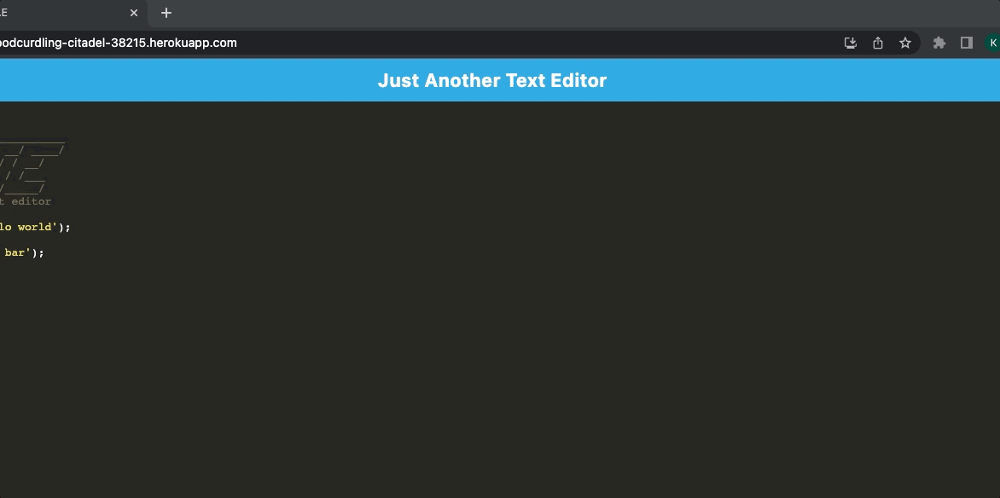
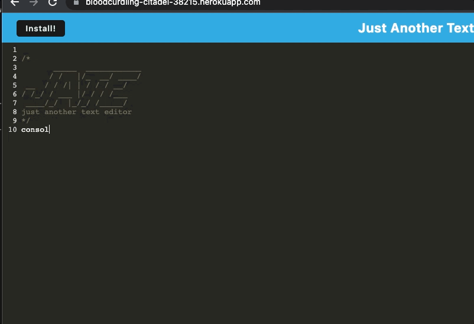
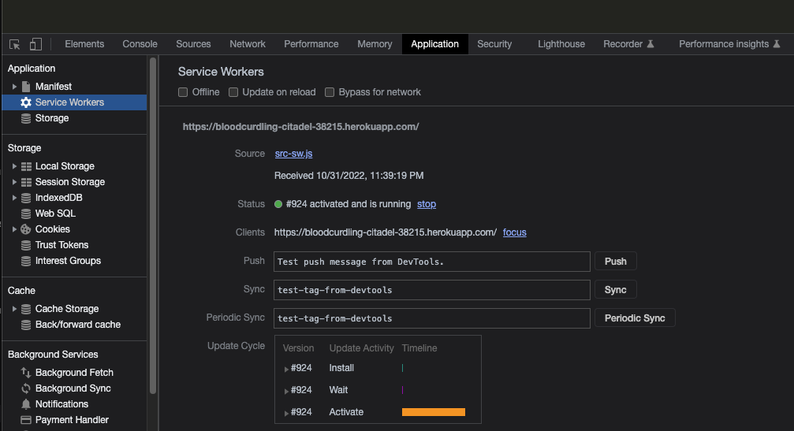
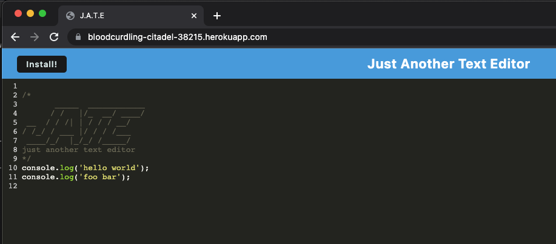

# 19 Progressive Web Applications (PWA): Text Editor

## Note Taker With JavaScript Syntax Highlighting

Completed the development of this progressive web app from the starter code given. Workbox plugins were added and configured to connect the service worker and manifest file. CSS loaders and Babel were added to webpack. The module.exports were completed for the webpack config file. Asset caching was successfully implemented. All event listeners were added to make the install buttons operational. Finally, all database routing was completed for adding and deleting notes from the note taking interface. The app works flawlessly on and offline, as well as in the browser window and as a downloaded PWA. 

---

## Areas Covered:
* The app is built primarily with JavaScript, and uses the client/server directory layout.
* Express.js is used for the routing.
* IDB is utilized for storing saved data from notes.
* The app uses a service worker for data caching. 
* The app is bundled using Webpack.
* The app is downloadable as a PWA.
* The app passes all Lighthouse analysis categories.

---

## Installation Instructions:
* Open the Heroku deployed app on the web browser
* Click the install icon an the right side of the address bar
* Click the install button on the dropdown alert
* User is now able to use the note taker as a PWA

---

## Tech Stack:
* JavaScript
* Node.js
* Webpack
* IDB (IndexedDB API)
* Express
* Babel

---

## About The Author:

My name is Kent Shaffer and I am a student coming to the end of UCSD's full stack web development bootcamp. Prior to starting the program I had zero code experience, so it feels I've been drinking in new information through a fire hose, but I have been loving learning, and I'm excited about all the possibilities that live within the scope of the technologies I have been learning.

If you have any questions or would like to get in contact, I can be reached at kentshaff@gmail.com 

---

## Heroku Link to Deployed App: 

(https://bloodcurdling-citadel-38215.herokuapp.com/)

---
## Screenshots and Gifs of app:

---
